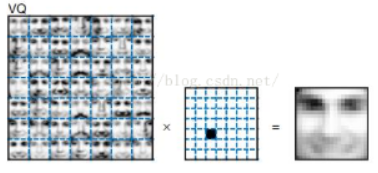

# NMFs (Nonnegative matrix factorizations)

# Introduction

非负矩阵分解，即再矩阵中所有元素均为非负数约束条件之下的矩阵分解方法。

实用性：

1. 大量数据分析方法需要通过矩阵形式进行有效处理
2. 实现上的简便性，分解形式和分解结果上的可解释性
3. 占用存储空间少

大量原始分解方法分解结果存在副职，但是负值元素再实际问题种往往是没意义的。

# Basic Theory

对于任意给定的一个非负矩阵 `A`， `NMF` 算法能够寻找到一个非负矩阵 `U`和一个非负矩阵 `V`，使得满足，从而将一个非负矩阵分解为左右两个非负矩阵的乘积。

其数学表达为:

$$A_{n*m} \approx U_{n*r} V_{r*m}$$

之所以是约等于，是因为当前解法并非精确解，而只是数值上的近似解。

分解后我们可以理解为：原始矩阵 `A` 的列向量是对左矩阵 `U` 种所有列向量的加权和，而权重系数就是右矩阵对应列向量的元素，故称 `U` 为基矩阵， `H`为稀疏矩阵。

其中 `r` 远小于 `n` 和 `m`。这是用稀疏矩阵代替源实矩阵，就可以实现对源实矩阵进行降维，得到数据特征的降维矩阵，从而减少存储空间。

`NMF` 再人脸识别的应用种和 `PCA` 还有 `VQ`分解不同。 

`VQ`分解是用一张完整的图像直接代表源脸部图像。

`PCA` 是将几个完整人脸加减压成一张脸。

`NMF` 是取甲的眼睛，乙的鼻子，丙的嘴巴直接拼成一张脸，也就是说 `NMF`分解后的基矩阵 `H`是每张人脸的一个特征部分，例如眼睛，鼻子，嘴巴等，然后权重矩阵对这些特征进行加权处理从而得到一张完整的人脸。

# Algorithm

非负矩阵分解中，代码采用的是原始论文中提及的基于乘法更新发展的迭代更新算法，将其矩阵分解算法转化为如下的优化问题，即最小化两个矩阵之间的欧几里得距离的优化问题：

$$\min ||V-V'||^2=\sum_{ij}(V_{ij}-V'_{ij})^2$$

其中， `V`为原始矩阵， `V'` 为分解后的矩阵重构而成的矩阵，即 *V' = H * W* 更新规则如下：

- `H` 矩阵的更新：其中*aμ*是指矩阵第*a*行第*μ*列元素，当分母为0时，对应位置元素不做更新

$$H_{a\mu} \leftarrow H_{a\mu} \frac{(W^\top V)_{a\mu}}{(W^\top WH)}_{a\mu}$$

- `W`矩阵的更新：其中 *ia* 是指矩阵第*i*行的第*a*列元素，当坟墓为0时，对应未知元素不做更新

$$W_{ia} \leftarrow W_{ia} \frac{(VH^\top)_{ia}}{(WHH^\top)}_{ia}$$

# Example

如 `2-digits`这张图，图中每两个数字构成一个子图，对应的右图为左图的一个主成分元素，即 `2-digits`这张图中的每个单一的数字都是一个主成分，要求利用主成分分析等方法将图中的数字一一分离出来，如左图所示。可以看出左图是由右图的一个组合构成的。

我们要分出8个主特征，即 `r=8`，原始图像中的没两个数字构成一个子图，由 *64*64* 的像素组成，共有64个子图，每个子图被张成一个4096的向量，因此 `V`矩阵为*4096*64* 维。

因此算法流程为：

1. 随机初始化一个*4096 * 8* 的矩阵 *`W`*和一个 *8*64* 的矩阵  *`H`*，设定误差阈值 `ε`和迭代轮数 `iter`
2. 按照上述的乘法更新规则更新 `W` 和 `H` 矩阵，迭代进行第二步
3. 输出 `W`矩阵， `W`矩阵的每一列即为一个特征，即对应的一个数字。将每一列重新展开为一个 64*64 的矩阵，转职后绘制出来，可以看到对应的8个数字。

可以看到，非负矩阵分解可以很好的将原图中的特征提取出来。

